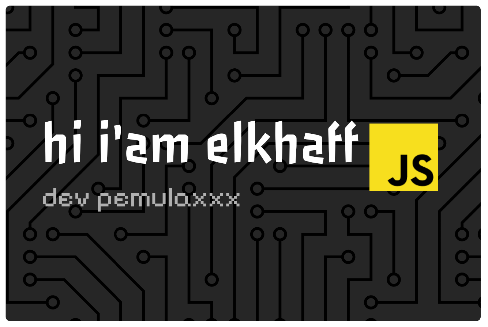

<!---->
<h1 align="center">Hey  I'm Elkhaff</h1>

  

    
  

  

    
    
  

---

  <picture>
    <source media="(prefers-color-scheme: dark)" srcset="https://streak-stats.demolab.com?user=elkhaff&locale=en&mode=daily&theme=microsoft-dark&hide_border=false&border_radius=5&order=3">
    <source media="(prefers-color-scheme: light)" srcset="https://streak-stats.demolab.com?user=elkhaff&locale=en&mode=daily&theme=microsoft&hide_border=false&border_radius=5&order=3">
    
  </picture>
  <picture>
    <source media="(prefers-color-scheme: dark)" srcset="https://github-profile-trophy.vercel.app?username=elkhaff&theme=dracula&column=-1&row=1&margin-w=8&margin-h=8&no-bg=false&no-frame=false&order=4">
    <source media="(prefers-color-scheme: light)" srcset="https://github-profile-trophy.vercel.app?username=elkhaff&theme=light&column=-1&row=1&margin-w=8&margin-h=8&no-bg=false&no-frame=false&order=4">
    
  </picture>

---

<picture>
  <source media="(prefers-color-scheme: dark)" srcset="./img/pacman/pacman-contribution-graph-dark.svg">
  <source media="(prefers-color-scheme: light)" srcset="./img/pacman/pacman-contribution-graph.svg">
  
</picture>

---

## 🌐 Connect with me

  <a href="https://instagram.com/elk_aff">
    <picture>
      <source media="(prefers-color-scheme: dark)" srcset="https://img.shields.io/badge/Instagram-%23E4405F.svg?style=flat-square&logo=Instagram&logoColor=white&labelColor=1e1e1e">
      <source media="(prefers-color-scheme: light)" srcset="https://img.shields.io/badge/Instagram-%23E4405F.svg?style=flat-square&logo=Instagram&logoColor=black&labelColor=f0f0f0">
      
    </picture>
  </a>
  <a href="https://facebook.com/elkaff27">
    <picture>
      <source media="(prefers-color-scheme: dark)" srcset="https://img.shields.io/badge/Facebook-%231877F2.svg?style=flat-square&logo=Facebook&logoColor=white&labelColor=1e1e1e">
      <source media="(prefers-color-scheme: light)" srcset="https://img.shields.io/badge/Facebook-%231877F2.svg?style=flat-square&logo=Facebook&logoColor=black&labelColor=f0f0f0">
      
    </picture>
  </a>
  <a href="https://tiktok.com/@elkaff27">
    <picture>
      <source media="(prefers-color-scheme: dark)" srcset="https://img.shields.io/badge/TikTok-%23000000.svg?style=flat-square&logo=TikTok&logoColor=white&labelColor=1e1e1e">
      <source media="(prefers-color-scheme: light)" srcset="https://img.shields.io/badge/TikTok-%23000000.svg?style=flat-square&logo=TikTok&logoColor=black&labelColor=f0f0f0">
      
    </picture>
  </a>

---

  <picture>
    <source media="(prefers-color-scheme: dark)" srcset="https://raw.githubusercontent.com/Tarikul-Islam-Anik/Animated-Fluent-Emojis/master/Emojis/Animals/Penguin.png">
    <source media="(prefers-color-scheme: light)" srcset="https://raw.githubusercontent.com/Tarikul-Islam-Anik/Animated-Fluent-Emojis/master/Emojis/Animals/Penguin.png">
    
  </picture>

---

## 🛠️ Skills

  <picture>
    <source media="(prefers-color-scheme: dark)" srcset="https://skillicons.dev/icons?i=nodejs&theme=dark">
    <source media="(prefers-color-scheme: light)" srcset="https://skillicons.dev/icons?i=nodejs&theme=light">
    
  </picture>
  <picture>
    <source media="(prefers-color-scheme: dark)" srcset="https://skillicons.dev/icons?i=js&theme=dark">
    <source media="(prefers-color-scheme: light)" srcset="https://skillicons.dev/icons?i=js&theme=light">
    
  </picture>
  <picture>
    <source media="(prefers-color-scheme: dark)" srcset="https://skillicons.dev/icons?i=npm&theme=dark">
    <source media="(prefers-color-scheme: light)" srcset="https://skillicons.dev/icons?i=npm&theme=light">
    
  </picture>

---

<picture>
  <source media="(prefers-color-scheme: dark)" srcset="./img/snake/snake-dark.svg">
  <source media="(prefers-color-scheme: light)" srcset="./img/snake/snake.svg">
  
</picture>

---

## 💖 Support Me in <a href="https://tako.id/elkaff">Tako ↗</a>

## 💖 My Waifu
<!--waifu-542-->

  
  
last update: 10-12-2025 06:23:55

<!--waifu-->
