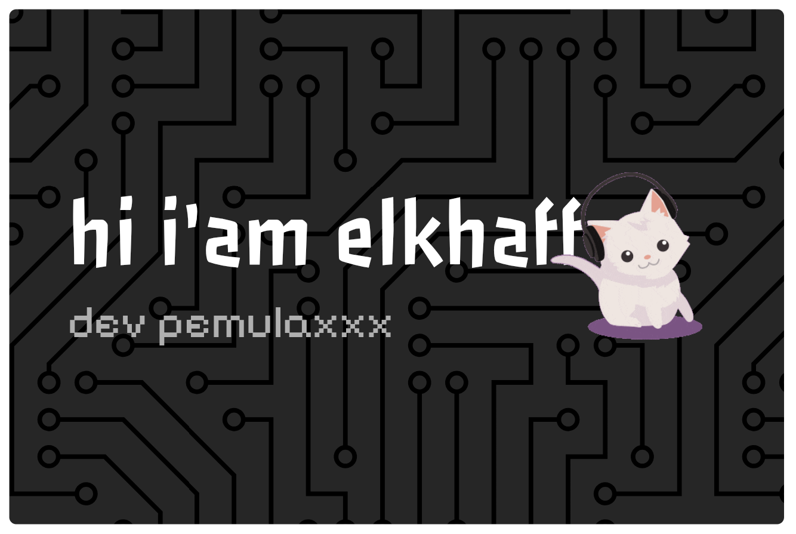

<h1 align="center">Hey  I'm Elkhaff</h1>

  

    
  

  

    
  

  
  

<picture>
  <source media="(prefers-color-scheme: dark)" srcset="./img/pacman/pacman-contribution-graph-dark.svg">
  <source media="(prefers-color-scheme: light)" srcset="./img/pacman/pacman-contribution-graph.svg">
  
</picture>

## 🌐 Connect with me

  
  
  

  

## 🛠️ Skills

  
  
  

<picture>
  <source media="(prefers-color-scheme: dark)" srcset="./img/snake/snake-dark.svg">
  <source media="(prefers-color-scheme: light)" srcset="./img/snake/snake.svg">
  
</picture>

## 💖 My Waifu

<!--waifu-67-->

  
  
last update: 03-12-2025 16:02:03

<!--waifu-->
